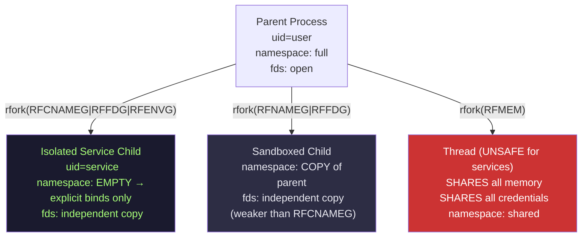
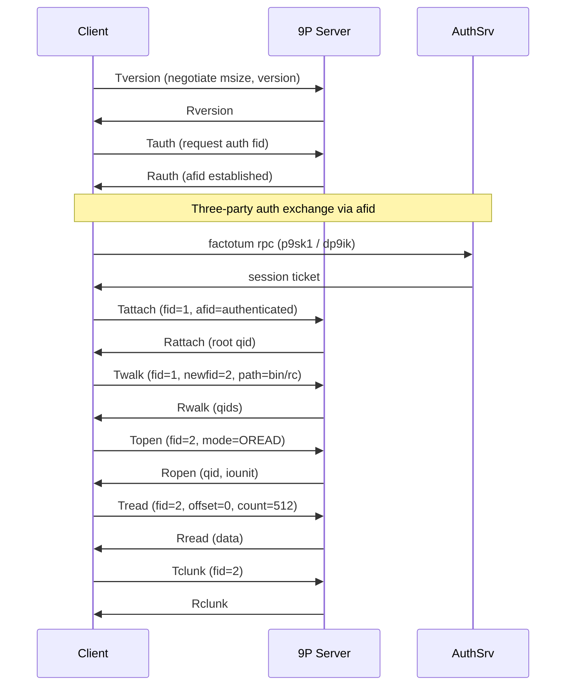
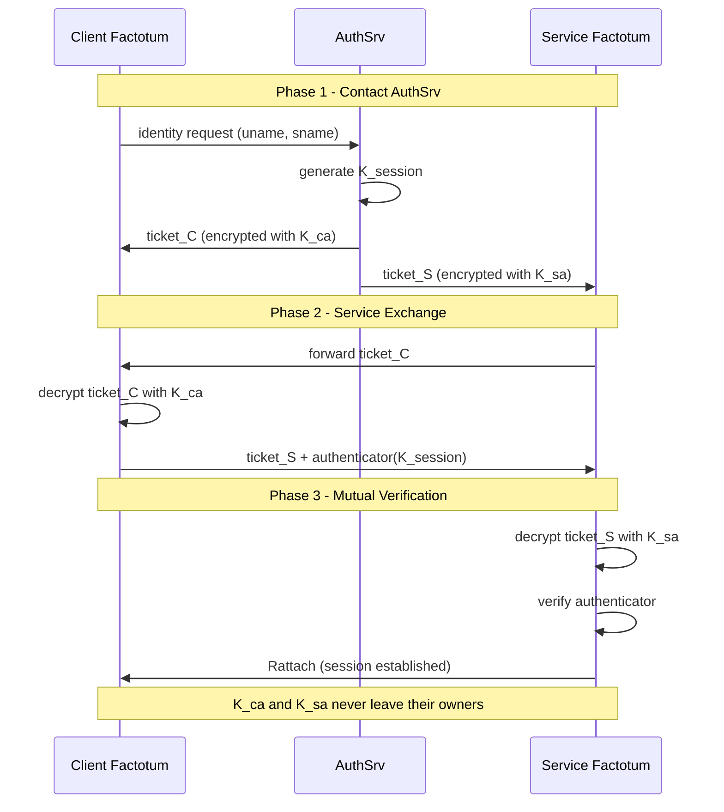
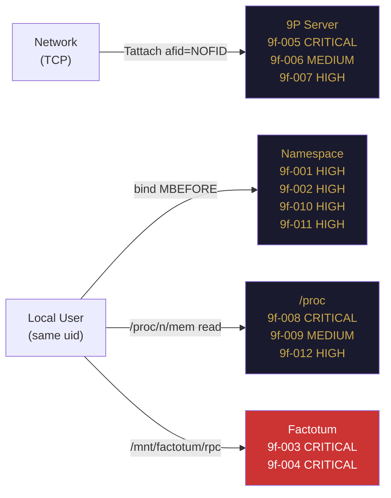

::: {.copyright-page}
**9front Cybersecurity Hardening Guide — Community Edition**

Author: Anastasios Papalias
Published: 2026
License: Creative Commons CC BY 4.0
Repository: github.com/AnastasiosPapalias/Plan9

*This is the free community edition. The Full Edition (200 pages) is available via Acopon Digital Publications.*

*Cover: visual concept developed with generative tools.*
:::


# Chapter 1: The Philosophy of Security in Plan 9


::: {.figure}

:::

Plan 9 security is architectural, not additive. Security properties emerge from the system design — namespace isolation, uniform file interface, per-process resource mapping — not from layers applied over an existing base.

| SURFACE: FOUNDATION |
| --- | --- |
| Resource access | Name in namespace → 9P server → file operation |
| No-access semantics | Name absent from namespace = resource does not exist |
| Stronger than ACL | Cannot bypass a missing namespace entry; can bypass a permission check |
| Trust anchor | Trust granted to servers, not to filesystem layer |


### Saltzer & Schroeder: Eight Principles [7]


| Principle | Plan 9 Implementation |
| --- | --- |
| Economy of mechanism | 38 syscalls; 5MB kernel; one file protocol; all security statable in one paragraph |
| Fail-safe defaults | rfork(RFCNAMEG) starts process with empty namespace. No inherited access. |
| Complete mediation | Every file operation is a 9P message processed by the server. No bypass. |
| Open design | 9front source publicly available. Security not predicated on secrecy. |
| Separation of privilege | Auth requires user key (factotum) AND valid response from authsrv. |
| Least privilege | RFCNAMEG enables services with only the resources they need. |
| Least common mechanism | Per-process namespaces eliminate shared filesystem state across trust levels. |
| Psychological acceptability | Weakest: namespace model non-intuitive. ENOENT not EPERM. Misconfiguration risk. |


# Chapter 2: Namespaces as Isolation


::: {.figure}

:::


**Figure: Namespace Tree**


```mermaid
graph TD
    ROOT[/ - root device #/] --> BIN[/bin - executables]
    ROOT --> LIB[/lib - libraries]
    ROOT --> USR[/usr - user homes]
    ROOT --> NET[/net - network #I]
    ROOT --> PROC[/proc - processes #p]
    ROOT --> DEV[/dev - devices #c #d]
    ROOT --> SRV[/srv - named servers]
    ROOT --> MNT[/mnt - mount points]
    MNT --> FACT[/mnt/factotum - auth agent]

    style ROOT fill:#1A1A2E,color:#C9A84C
    style FACT fill:#CC3333,color:#fff
    style PROC fill:#2D2D44,color:#E8E8F0
    style SRV fill:#2D2D44,color:#E8E8F0
```

A Plan 9 namespace is a per-process mapping from path names to 9P servers. It is not a restriction on a global view — it is the entirety of what the process can see.

### Construction Syscalls


| Operation | Effect |
| --- | --- |
| bind(src, dst, MREPLACE) | Replace existing bindings at dst with src |
| bind(src, dst, MBEFORE) | Add src BEFORE existing bindings (first in union resolution) |
| bind(src, dst, MAFTER) | Add src AFTER existing bindings (last in union resolution) |
| mount(fd, afd, dst, flags, aname) | Attach 9P server on fd to dst; afd=-1 = unauthenticated (local only) |


### rfork Isolation Flags


| Flag | Effect | Security Use |
| --- | --- | --- |
| RFNAMEG | Copy of parent namespace | Standard service isolation |
| RFCNAMEG | EMPTY namespace | Maximum isolation — PREFERRED for new services |
| RFFDG | Copy of fd table | Prevents fd leakage |
| RFENVG | Copy of /env | Prevents env injection |
| RFNOTEG | New note group | Prevents note injection from parent |
| RFMEM | SHARES parent memory | NEVER for service children |


### Attack Vectors


| SURFACE: NAMESPACE |
| --- | --- |
| 9f-001 MBEFORE injection | bind attacker dir over /bin MBEFORE; parent resolves attacker first; requires shared namespace |
| 9f-010 Rogue /srv | Register attacker 9P server in /srv before legitimate server; victim mounts by name |
| 9f-011 NS inheritance | rfork without RFNAMEG; compromised child binds into shared namespace; ATT&CK T1611 (analogical) |
| Recon | /proc/n/ns is owner-readable; reveals all bind/mount entries and ordering |

Correct flag set for network service child processes: rfork(RFPROC|RFNAMEG|RFFDG|RFENVG)

# Chapter 3: Files and Trust Boundaries


::: {.figure}

:::

Every resource in Plan 9 is served through 9P. The uniformity means one interface to secure. The cost: trust is placed in servers, not in a kernel enforcement layer.

### The /srv Directory


| SURFACE: FILESYSTEM |
| --- | --- |
| Purpose | Kernel-maintained registry of named 9P server file descriptors |
| Registration | Server creates /srv/<name>; writes file descriptor to it |
| Mount client | Client reads /srv/<name> to obtain fd; then calls mount(fd, path, flags) |
| Attack risk | Name collision: attacker registers /srv/kfs before legitimate server starts |
| Permission | Standard Plan 9 file permissions (uid/gid/other read/write) |


### Attach Boundary


| Method | Security |
| --- | --- |
| Tauth + Tattach (authenticated) | factotum conducts 3-party exchange before access granted |
| Tattach afid=NOFID (unauthenticated) | No identity established; server MUST reject from remote clients |
| Local pipe (unauthenticated) | Acceptable — identity established by process context |
| Network TCP (unauthenticated) | OPEN DOOR to entire exported namespace — never acceptable |


### Evaluation Checklist

For each mounted server: what is its provenance? Who started it? What uid does it run as?
For each /srv entry: was it created at startup? Does it still point to the expected server?
For each network export: is TLS active? Is authenticated attach required?

# Chapter 4: Process Model and rfork


::: {.figure}

:::


**Figure: Process Model and rfork**




Processes are files. /proc exposes every running process as a directory. Security of process isolation is security of /proc access.

### /proc File Interface


| File | Permissions | Contents | Security Risk |
| --- | --- | --- | --- |
| /proc/n/status | World-readable | PID, name, uid, gid, state, memory | Reconnaissance |
| /proc/n/ns | Owner-readable | Full namespace map | Complete recon target — capture first in IR |
| /proc/n/mem | Owner/hostowner RW | Raw address space | CRITICAL: key theft (9f-008) |
| /proc/n/text | Owner-readable | Executable image | Integrity verification; identity check |
| /proc/n/ctl | Owner write-only | kill, stop, start, profile | DoS via kill |
| /proc/n/note | Owner write-only | Deliver note (signal) | Note injection (9f-009) |
| /proc/n/fd | Owner-readable | Open fd inventory | Credential leakage (9f-012) |


| SURFACE: /PROC |
| --- | --- |
| Uid boundary | Only isolation boundary within /proc. Same uid = full access to mem, ctl, note. |
| Hostowner | Reads any process mem regardless of uid. |
| Service design | Dedicated uid per service limits /proc blast radius. |
| 9f-008 mem read | Same-uid read of /proc/target/mem extracts session keys, factotum keys. ATT&CK T1055. |
| 9f-009 note inj. | Write unexpected note to /proc/target/note. ATT&CK T1055.008. |
| 9f-012 fd leak | Read /proc/target/fd to enumerate open resources. ATT&CK T1083. |


# Chapter 5: 9P and Network Exposure


::: {.figure}

:::


**Figure: 9P Protocol Message Flow**




9P is the universal resource access protocol. Every local file operation is 9P internally. Every network file export is 9P explicitly.

### Message Header


| size[4] type[1] tag[2]   size: total message bytes including size field   type: T/R-message type (Tversion=100, Tattach=104, ...)   tag:  transaction identifier; NOTAG=0xFFFF for Tversion only |
| --- |


### Key Protocol Elements


| Element | Definition |
| --- | --- |
| fid | 32-bit handle for an open file reference in a session. NOFID=0xFFFFFFFF. |
| qid | 13-byte unique file identifier: type[1] + version[4] + path[8]. |
| Tversion | First message. Negotiates max message size (msize). Must use NOTAG. |
| Tattach | Establish session root. afid=NOFID = unauthenticated (reject from network). |
| Twalk | Traverse path components from existing fid. Max 16 components per message. |
| Topen | Open a fid for I/O. Returns qid and iounit. |


| SURFACE: 9P PROTOCOL |
| --- | --- |
| 9f-005 unauth attach | Tattach afid=NOFID accepted. Full namespace access. ATT&CK T1133. CRITICAL. |
| 9f-006 fid exhaustion | Open fids without Tclunk fills fid table. ATT&CK T1499. Mitigation: per-session limit <=32. |
| 9f-007 replay | Capture auth Tattach; replay to different server. ATT&CK T1557. Mitigation: TLS + dp9ik nonces. |
| Path traversal | Walk '..' components to escape export root. Mitigation: exportfs -r tracks position. |


### Required Network Controls


| aux/listen1 tcp!*!564 /bin/tlssrv -a /bin/exportfs -r /exported/path # TLS required for all network 9P — no exceptions # Reject Tattach afid=NOFID from non-loopback addresses # Per-session fid limit (<=32 recommended) # Port 564: IANA-assigned for plan9file |
| --- |


# Chapter 6: Factotum and Authentication


::: {.figure}

:::


**Figure: Factotum Authentication Flow**




Factotum is the authentication agent. It holds credentials and performs authentication on behalf of all processes. Applications never handle credentials directly.

### Interface


| SURFACE: FACTOTUM |
| --- | --- |
| Mount point | /mnt/factotum (userspace 9P server, mounted in process namespace) |
| rpc file | Authentication channel. Write start message; read/write protocol exchange. |
| ctl file | Key management. Add, delete, list keys. Confidential attributes prefixed with '!'. |
| needkey | Block until factotum needs user input for interactive key entry. |


### Authentication Protocols


| Protocol | Description | Source |
| --- | --- | --- |
| p9any | Negotiation wrapper. Advertises supported protocols; vulnerable to downgrade without TLS. | Bell Labs |
| p9sk1 | Shared-secret challenge-response. Three-party: client factotum + authsrv + service key. | auth.pdf [4] |
| dp9ik | 9front-specific Diffie-Hellman protocol. Forward secrecy. NOT in Bell Labs auth.pdf. | sys/src/cmd/auth/ (9front only) |
| secstore | Encrypted persistent key storage. PAK exchange — passphrase never transmitted. | 9front FQA [6] |


| SURFACE: FACTOTUM |
| --- | --- |
| 9f-003 RPC intercept | Same-uid process writes to /mnt/factotum/rpc. ATT&CK T1552. CRITICAL. |
| 9f-004 key theft | Same-uid reads plaintext key file before factotum loads. Eliminated by secstore. |
| Rogue mount | Attacker binds different server over /mnt/factotum. ATT&CK T1574. |
| Protocol downgrade | Strip strong options from p9any. Requires network position + no TLS. |
| Memory extraction | Same-uid reads /proc/factotum/mem. ATT&CK T1055. Mitigation: dedicated uid. |


# Chapter 7: Debugging and Observation


::: {.figure}

:::

Debugging and attacking use the same interface: /proc. Access control (uid-based file permissions) is the only separation.

### System Observation Files


| File | Access | Contents |
| --- | --- | --- |
| /dev/sysstat | World-readable | Per-CPU: scheduled procs, context switches, syscalls, faults |
| /dev/swap | World-readable | Physical memory, free memory, swap usage, kernel memory |
| /proc/n/ns | Owner-readable | Full namespace map — complete trust topology |
| /proc/n/mem | Owner/hostowner | Raw address space — all in-memory secrets |


### What Polling Can and Cannot Detect


| Can Detect | Cannot Reliably Detect |
| --- | --- |
| Persistent namespace modifications (bind/mount that survives poll interval) | Transient processes (start, act, exit within one poll interval) |
| New /srv registrations | Individual system call events (no audit bus equivalent) |
| New running processes | File access events (no inotify equivalent) |
| Changed executable hashes (/proc/n/text) | Packet-level network events (no pcap in base system) |
| Unexpected network connections (/net/tcp/*/remote) | In-memory key extraction (leaves no filesystem trace) |


### Monitoring Cadence


| Observable | Interval | Rationale |
| --- | --- | --- |
| Namespace + /srv | 30-60 seconds | Exposure window should be measured in seconds |
| Executable hashes | 5-10 minutes | Binary changes are not instantaneous |
| Process list | 60 seconds | Cross-reference parent pid against known tree |
| Network connections | 60 seconds | Alert on connections to 9P ports from unexpected sources |


# Chapter 8: Threat Modeling


::: {.figure}

:::


**Figure: Attack Surface Map**




Four primary attack surfaces. Every significant 9front threat interacts with at least one.

### Threat Dataset Summary


| ID | Name | Surface | ATT&CK | Severity |
| --- | --- | --- | --- | --- |
| 9f-001 | namespace_escape | namespace | T1574 | HIGH |
| 9f-002 | namespace_injection | namespace | T1574 | HIGH |
| 9f-003 | factotum_rpc_interception | factotum | T1552 | CRITICAL |
| 9f-004 | factotum_key_theft | factotum | T1552.004 | CRITICAL |
| 9f-005 | 9p_unauthenticated_attach | 9p | T1133 | CRITICAL |
| 9f-006 | 9p_fid_exhaustion | 9p | T1499 | MEDIUM |
| 9f-007 | 9p_replay_attack | 9p | T1557 | HIGH |
| 9f-008 | proc_memory_read | /proc | T1055 | CRITICAL |
| 9f-009 | proc_note_injection | /proc | T1055.008 | MEDIUM |
| 9f-010 | srv_rogue_registration | namespace | T1574 | HIGH |
| 9f-011 | rfork_namespace_inheritance | namespace | T1611* | HIGH |
| 9f-012 | fd_leakage | /proc | T1083 | HIGH |

* T1611 (Escape to Host) is an analogical mapping for rfork namespace inheritance. No Plan 9-specific ATT&CK technique exists.

### STRIDE by Surface


| Surface | Spoofing | Tampering | Info Disc. | DoS | EoP |
| --- | --- | --- | --- | --- | --- |
| namespace | Rogue /srv server | bind injection | ns enumeration | mount loop | bind over /bin |
| factotum | Rogue factotum mount | key modification | RPC interception | RPC exhaustion | proto downgrade |
| 9P network | Server impersonation | message replay | plaintext capture | fid exhaustion | unauth attach |
| /proc | Process impersonation | ctl injection | mem/fd read | kill flood | note injection |


# Chapter 9: Hardening Strategies


::: {.figure}

:::

Hardening is the systematic reduction of attack surface through deliberate namespace construction, correct rfork flag use, authenticated network exposure, and credential protection.

| SURFACE: ALL SURFACES |
| --- | --- | --- | --- | --- |
| Namespace start | All privileged services start with rfork(RFCNAMEG) — empty namespace |
| Bind discipline | Bind exactly the directories needed. Document the sequence. Audit against documentation. |
| Union ordering | More trusted server bound MBEFORE less trusted. |
| Factotum scope | Do not include /mnt/factotum in namespaces of services that do not authenticate. |
| rfork flags | rfork(RFPROC\|RFNAMEG\|RFFDG\|RFENVG) for all network service children |
| NEVER RFMEM | RFMEM for service children shares all memory including secrets. Never use. |
| 9P TLS | TLS required for all network 9P. tlssrv handles wrapping. |
| 9P auth | Reject Tattach afid=NOFID from non-loopback addresses. |
| fid limit | Reject Twalk when session fid count exceeds threshold (<=32 recommended). |
| Secstore | auth/secstore for all persistent key storage. No plaintext key files on disk. |
| Uid isolation | Dedicated uid per service. Limits /proc-based lateral movement. |


| # Required configuration for any network-exposed 9P server: aux/listen1 tcp!*!564 /bin/tlssrv -a /bin/exportfs -r /exported/path |
| --- |


### OpenBSD Comparison


| Approach | Mechanism | When Excluded |
| --- | --- | --- |
| Plan 9 RFCNAMEG + bind | Construction-time restriction. Excluded paths never existed. Cannot be bypassed. | Not retrofittable — requires design from scratch |
| OpenBSD pledge(2) | Runtime syscall restriction. SIGABRT on violation; ENOSYS with 'error' promise. | Retrofittable to existing programs |
| OpenBSD unveil(2) | Runtime filesystem restriction. Unveiled paths visible; others return ENOENT. | Retrofittable but weaker than construction-time |


# Chapter 10: Detection Engineering


::: {.figure}

:::

Detection in Plan 9 is filesystem polling. No kernel audit framework. Observable surface: /proc, /dev/sysstat, /dev/swap, /srv, /net.

### Detection Capability 1: Namespace Integrity


| #!/bin/rc # baseline: sha1sum /proc/*/ns > /etc/security/ns-baseline fn check_ns {     for pid in /proc/^*/ns {         n=`{echo $pid\|sed 's\|/proc/\|\|;s\|/ns\|\|'}         h=`{sha1sum $pid 2>/dev/null\|awk '{print $1}'}         if(! ~ $h '' && ! grep -q $h /etc/security/ns-whitelist 2>/dev/null)             echo NS_ALERT pid=$n hash=$h `{date}     } } # D3FEND: D3-PM (Process Monitoring) |
| --- | --- | --- | --- | --- | --- | --- | --- | --- |


### Detection Capability 2: Executable Integrity


| fn check_text {     for pid in /proc/^*/text {         n=`{echo $pid\|sed 's\|/proc/\|\|;s\|/text\|\|'}         h=`{sha1sum $pid 2>/dev/null\|awk '{print $1}'}         if(! ~ $h '' && ! grep -q $h /etc/security/text-whitelist 2>/dev/null)             echo TEXT_ALERT pid=$n hash=$h `{date}     } } # D3FEND: D3-SFV (Software File Verification) |
| --- | --- | --- | --- | --- | --- | --- | --- | --- |


### Detection Capabilities 3-5


| Capability | Observable | D3FEND | Alert Condition |
| --- | --- | --- | --- |
| 3: /srv monitoring | ls -la /srv diff | D3-BA (Baseline) | Any new or removed /srv entry |
| 4: Network connections | /net/tcp/*/remote | D3-NTA (Network Traffic Analysis) | Address not in whitelist |
| 5: Process audit | /proc/n/status | D3-PM (Process Monitoring) | Unknown parent pid |

Alert delivery: Write alerts to remote syslog destination — not local log file (attackers can modify local logs).

# Chapter 11: Incident Response


::: {.figure}

:::

Incident response on 9front is namespace forensics. Capture before remediation. Scope by uid of compromised process.

### Phase 1: Capture


| #!/bin/rc stamp=`{date\|tr ' /' '__'} capdir=/tmp/ir-$stamp mkdir -p $capdir/ns $capdir/status $capdir/fd $capdir/text for pid in `{ls /proc} {     if(test -d /proc/$pid) {         cp /proc/$pid/ns $capdir/ns/$pid 2>/dev/null         cp /proc/$pid/status $capdir/status/$pid 2>/dev/null         cp /proc/$pid/fd $capdir/fd/$pid 2>/dev/null         sha1sum /proc/$pid/text > $capdir/text/$pid 2>/dev/null     } } ls -la /srv > $capdir/srv cat /net/tcp/*/remote > $capdir/tcp 2>/dev/null |
| --- | --- |


### Phases 2-4


| Phase | Action | Command |
| --- | --- | --- |
| 2: Analysis | Namespace diff against baseline; unknown executables | diff $capdir/ns/* baseline; sha1sum check |
| 3: Containment | Remove rogue /srv; kill compromised process | rm /srv/suspicious; echo kill > /proc/$pid/ctl |
| 4: Recovery | Key rotation; secstore update | auth/changeuser; kill factotum; restart factotum |


# Chapter 12: AI-Driven Security


::: {.figure}

:::

The companion security_dataset.jsonl encodes the threat analysis in STIX 2.1 format, enabling AI systems to reason over 9front security knowledge directly.

### Dataset Schema


| SURFACE: AI LAYER |
| --- | --- | --- | --- | --- |
| Format | NDJSON — one STIX 2.1 attack-pattern object per line |
| STIX type | attack-pattern with spec_version 2.1 |
| ID pattern | attack-pattern--9front-NNN |
| Extension | x_9front_ prefix per STIX 2.1 custom property convention |
| x_9front_vector | Specific mechanism — the exact operation an attacker performs |
| x_9front_surface | Attack surface: namespace \| 9p \| /proc \| factotum |
| x_9front_detection | What to poll; what constitutes an alert condition |
| x_9front_mitigation | Specific system calls and file paths for remediation |
| x_9front_severity | CRITICAL \| HIGH \| MEDIUM |
| x_9front_references | Primary source documents for technical claims |


### ATT&CK Mapping Quality


| Quality | Techniques | Note |
| --- | --- | --- |
| Direct | T1133, T1499, T1552, T1552.004, T1557, T1083, T1055 | Direct enterprise equivalents exist |
| Parent preferred | T1574 | Use parent, NOT T1574.006 (dynamic linker — wrong mechanism) |
| Analogical | T1611 | Escape to Host — analogical for rfork namespace inheritance; always flagged |


### NIST AI RMF Alignment [9]


| Function | Implementation |
| --- | --- |
| GOVERN | Dataset limitations documented: no Plan 9 ATT&CK; all mappings analogical; dp9ik source noted. |
| MAP | 12 entries cover all four primary attack surfaces. |
| MEASURE | Technical claims backed by primary sources [1]–[6]. |
| MANAGE | Dataset versioned on GitHub; updates as threat landscape evolves. |

NIST AI RMF is a voluntary framework. It recommends practices; it does not mandate them.

# Threat Dataset (security_dataset.jsonl) — Summary


| ID | Name | Surface | ATT&CK | Severity | Key Mitigation |
| --- | --- | --- | --- | --- | --- |
| 9f-001 | namespace_escape | namespace | T1574 | HIGH | rfork(RFNAMEG); poll /proc/n/ns |
| 9f-002 | namespace_injection | namespace | T1574 | HIGH | Monitor /srv; verify ownership before mount |
| 9f-003 | factotum_rpc_intercept | factotum | T1552 | CRITICAL | Dedicated uid; exclude /mnt/factotum from service ns |
| 9f-004 | factotum_key_theft | factotum | T1552.004 | CRITICAL | auth/secstore — no plaintext keys on disk |
| 9f-005 | 9p_unauth_attach | 9p | T1133 | CRITICAL | tlssrv -a; reject afid=NOFID from network |
| 9f-006 | 9p_fid_exhaustion | 9p | T1499 | MEDIUM | Per-session fid limit <=32 |
| 9f-007 | 9p_replay_attack | 9p | T1557 | HIGH | TLS + dp9ik session nonces |
| 9f-008 | proc_memory_read | /proc | T1055 | CRITICAL | Dedicated uid per service |
| 9f-009 | proc_note_injection | /proc | T1055.008 | MEDIUM | RFNOTEG at fork; dedicated uid |
| 9f-010 | srv_rogue_registration | namespace | T1574 | HIGH | Monitor /srv; alert on any change |
| 9f-011 | rfork_ns_inheritance | namespace | T1611* | HIGH | rfork(RFNAMEG) always for service children |
| 9f-012 | fd_leakage | /proc | T1083 | HIGH | RFCFDG at fork; close unused fds before exec |

* T1611 is an analogical mapping. T1574.006 is never used (dynamic linker hijacking — wrong mechanism for Plan 9 bind misuse). All ATT&CK mappings are analogical; ATT&CK contains no Plan 9-specific techniques.

# Bibliography & Sources

All technical claims in this edition trace to primary sources. The 9front FQA at fqa.9front.org is the authoritative reference for 9front-specific behavior.

| Ref | Source | URL |
| --- | --- | --- |
| [1] | Plan 9 System Overview | doc.cat-v.org/.../plan9.pdf |
| [2] | Namespaces in Plan 9 | doc.cat-v.org/.../namespaces.pdf |
| [3] | 9P Protocol | doc.cat-v.org/.../9p.pdf |
| [4] | Authentication (Bell Labs) — p9sk1 ONLY | doc.cat-v.org/.../auth.pdf |
| [5] | Plan 9 Security | doc.cat-v.org/.../security.pdf |
| [6] | 9front FQA (authoritative for dp9ik) | fqa.9front.org/fqa.pdf |
| [7] | Saltzer & Schroeder 1975 — Proc. IEEE Vol.63 No.9 pp.1278-1308 | web.mit.edu/.../protection.pdf |
| [8] | NIST SP 800-30 Rev 1 | nvlpubs.nist.gov |
| [9] | NIST AI RMF (AI 100-1) — Voluntary | nvlpubs.nist.gov/.../AI.100-1.pdf |
| [10] | ATT&CK Enterprise (all Plan 9 mappings analogical) | attack.mitre.org |
| [11] | STIX 2.1 Specification | docs.oasis-open.org/.../stix-v2.1 |
| [12] | D3FEND | d3fend.mitre.org |
| [13] | OpenBSD pledge(2) | man.openbsd.org/pledge.2 |
| [14] | OpenBSD unveil(2) | man.openbsd.org/unveil.2 |
| [15] | Anderson: Security Engineering 3e | cl.cam.ac.uk/~rja14/Papers/SEv3.pdf |

Note on dp9ik: 9front-specific. Not documented in Bell Labs auth.pdf [4]. Source: sys/src/cmd/auth/ in 9front repository.
Note on ATT&CK mappings: All mappings are analogical. ATT&CK contains no Plan 9-specific techniques.

# Companion Files


| File | Description |
| --- | --- |
| security_dataset.jsonl | 12 STIX 2.1 attack-pattern objects. One per line. Machine-readable threat dataset. |
| README.md | GitHub landing page. Overview, usage, license, technical accuracy notes. |
| diagrams/namespace_tree.md | Mermaid: Plan 9 namespace hierarchy diagram. |
| diagrams/9p_flow.md | Mermaid: 9P protocol message flow sequence diagram. |
| diagrams/process_model.md | Mermaid: rfork isolation model diagram. |
| diagrams/factotum_auth.md | Mermaid: Three-party factotum authentication sequence. |
| diagrams/attack_surface_map.md | Mermaid: Complete attack surface map. |


### Dataset Field Reference


| {   "id": "attack-pattern--9front-NNN",   "type": "attack-pattern",   "spec_version": "2.1",   "name": "<threat_name>",   "kill_chain_phases": [{"kill_chain_name": "mitre-attack", "phase_name": "..."}],   "external_references": [{"source_name": "mitre-attack", "external_id": "T...",                              "description": "mapping quality note"}],   "x_9front_vector": "specific attack operation",   "x_9front_surface": "namespace \| 9p \| /proc \| factotum",   "x_9front_detection": "what to poll, alert condition",   "x_9front_mitigation": "specific syscalls and paths",   "x_9front_severity": "CRITICAL \| HIGH \| MEDIUM",   "x_9front_references": ["source.pdf"] } |
| --- | --- | --- | --- | --- | --- |

