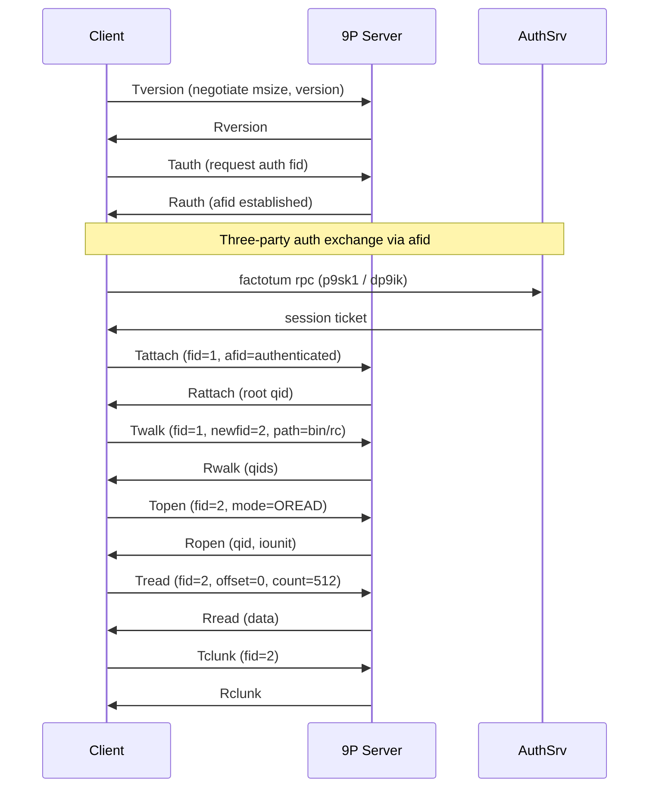

# 9P Protocol Message Flow

```mermaid
sequenceDiagram
    participant C as Client
    participant S as 9P Server
    participant A as AuthSrv

    C->>S: Tversion (negotiate msize, version)
    S->>C: Rversion

    C->>S: Tauth (request auth fid)
    S->>C: Rauth (afid established)

    Note over C,A: Three-party auth exchange via afid
    C->>A: factotum rpc (p9sk1 / dp9ik)
    A->>C: session ticket

    C->>S: Tattach (fid=1, afid=authenticated)
    S->>C: Rattach (root qid)

    C->>S: Twalk (fid=1, newfid=2, path=bin/rc)
    S->>C: Rwalk (qids)

    C->>S: Topen (fid=2, mode=OREAD)
    S->>C: Ropen (qid, iounit)

    C->>S: Tread (fid=2, offset=0, count=512)
    S->>C: Rread (data)

    C->>S: Tclunk (fid=2)
    S->>C: Rclunk
```
