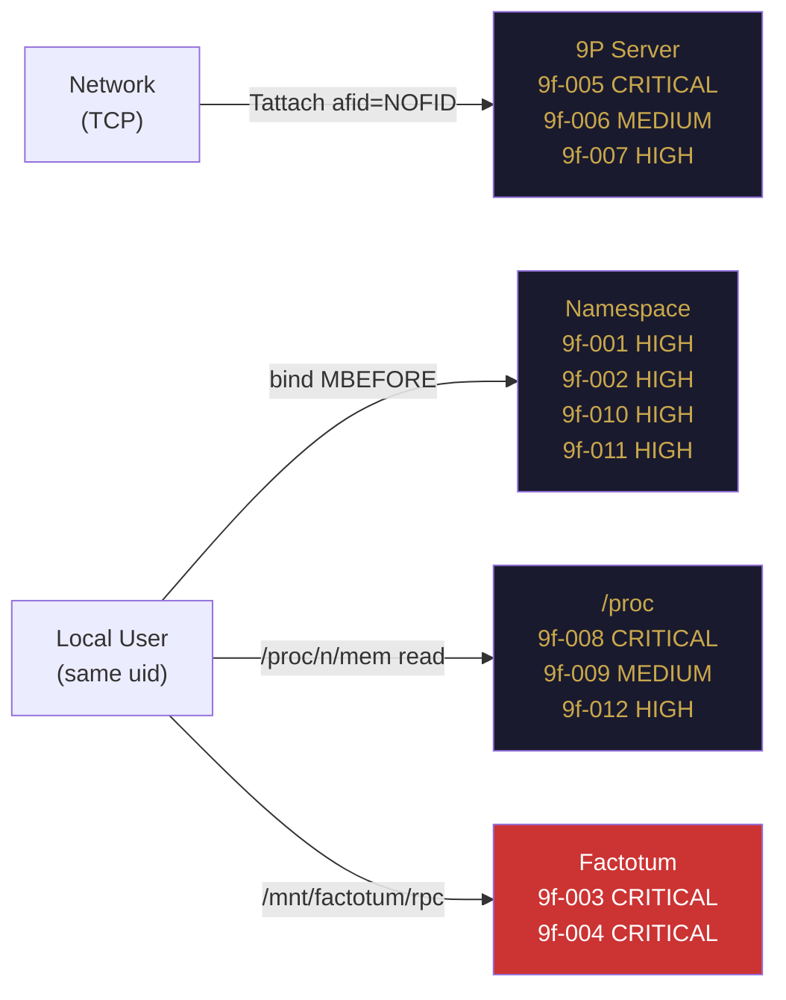

# 9front Attack Surface Map

```mermaid
graph LR
    NET["Network\n(TCP)"] -->|Tattach afid=NOFID| 9P["9P Server\n9f-005 CRITICAL\n9f-006 MEDIUM\n9f-007 HIGH"]
    
    LOCALUSER["Local User\n(same uid)"] -->|bind MBEFORE| NS["Namespace\n9f-001 HIGH\n9f-002 HIGH\n9f-010 HIGH\n9f-011 HIGH"]
    
    LOCALUSER -->|/proc/n/mem read| PROC["/proc\n9f-008 CRITICAL\n9f-009 MEDIUM\n9f-012 HIGH"]
    
    LOCALUSER -->|/mnt/factotum/rpc| FACT["Factotum\n9f-003 CRITICAL\n9f-004 CRITICAL"]
    
    style 9P fill:#1A1A2E,color:#C9A84C
    style NS fill:#1A1A2E,color:#C9A84C
    style PROC fill:#1A1A2E,color:#C9A84C
    style FACT fill:#CC3333,color:#fff
```
