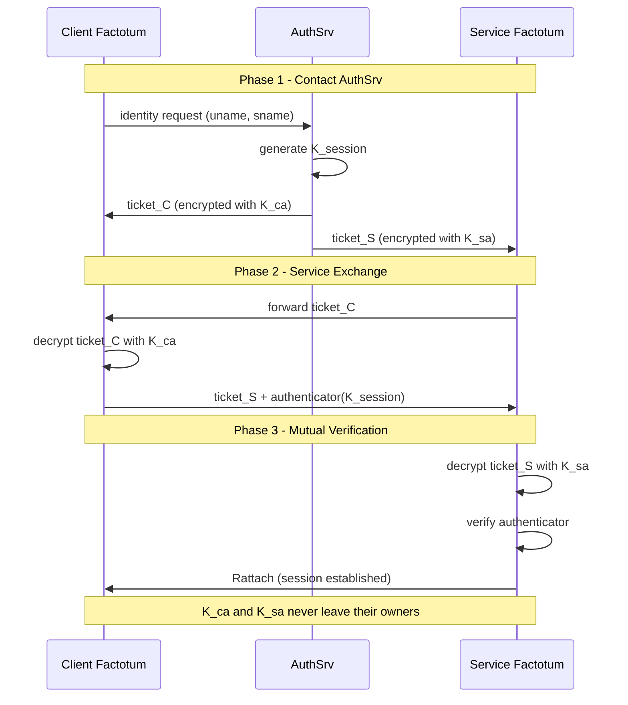

# Three-Party Factotum Authentication (p9sk1)

```mermaid
sequenceDiagram
    participant CF as Client Factotum
    participant AS as AuthSrv
    participant SF as Service Factotum

    Note over CF,SF: Phase 1 - Contact AuthSrv
    CF->>AS: identity request (uname, sname)
    AS->>AS: generate K_session
    AS->>CF: ticket_C (encrypted with K_ca)
    AS->>SF: ticket_S (encrypted with K_sa)

    Note over CF,SF: Phase 2 - Service Exchange
    SF->>CF: forward ticket_C
    CF->>CF: decrypt ticket_C with K_ca
    CF->>SF: ticket_S + authenticator(K_session)

    Note over CF,SF: Phase 3 - Mutual Verification
    SF->>SF: decrypt ticket_S with K_sa
    SF->>SF: verify authenticator
    SF->>CF: Rattach (session established)

    Note over CF,SF: K_ca and K_sa never leave their owners
```
