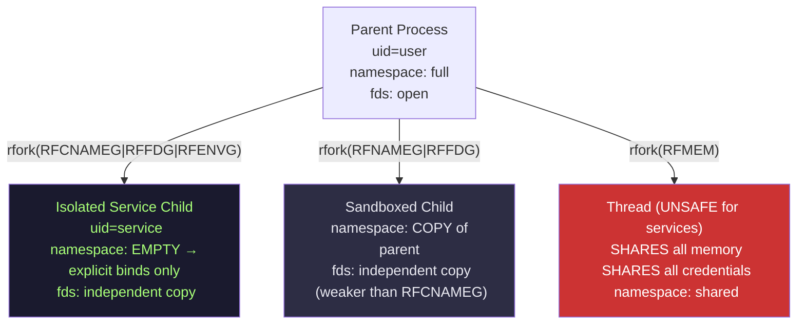

# Plan 9 rfork Isolation Model

```mermaid
graph TD
    PARENT["Parent Process\n uid=user\n namespace: full\n fds: open"] 
    
    PARENT -->|"rfork(RFCNAMEG|RFFDG|RFENVG)"| ISOLATED["Isolated Service Child\n uid=service\n namespace: EMPTY → explicit binds only\n fds: independent copy"]
    
    PARENT -->|"rfork(RFNAMEG|RFFDG)"| COPY["Sandboxed Child\n namespace: COPY of parent\n fds: independent copy\n (weaker than RFCNAMEG)"]
    
    PARENT -->|"rfork(RFMEM)"| THREAD["Thread (UNSAFE for services)\n SHARES all memory\n SHARES all credentials\n namespace: shared"]
    
    style ISOLATED fill:#1A1A2E,color:#A8FF78
    style THREAD fill:#CC3333,color:#fff
    style COPY fill:#2D2D44,color:#E8E8F0
```
