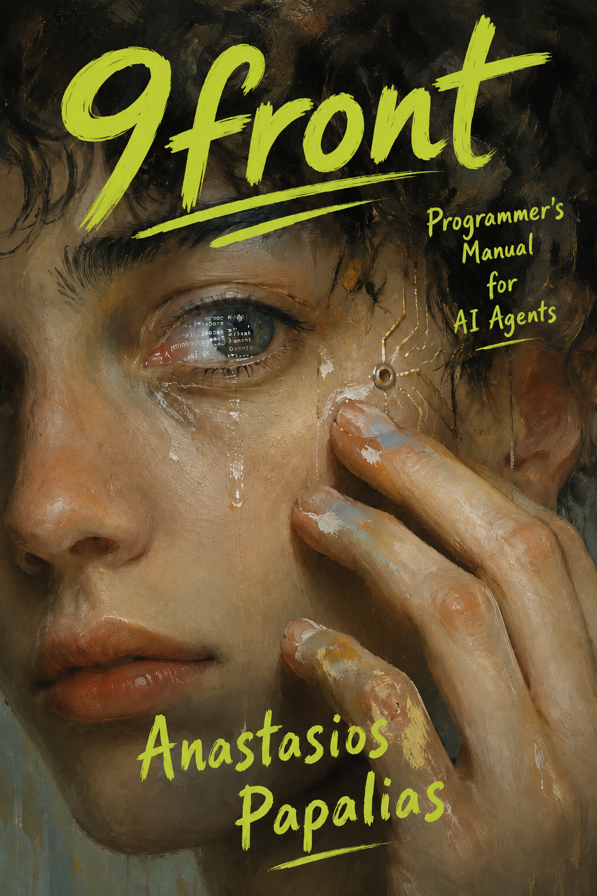

# 📚 AnastasiosPapalias — Library

Books, manuals, and research publications by **Anastasios Papalias**.

All community editions are free. Paid editions available via [acopon.online](https://acopon.online).

---

## Books

### 9front Cybersecurity Hardening Guide

**A practical security hardening guide for Plan 9 / 9front systems.**

Covers namespace isolation, factotum authentication, 9P protocol security, rfork process isolation, and the complete attack surface map. Includes a STIX 2.1 threat dataset (12 attack-pattern objects), Mermaid architecture diagrams, and full ATT&CK mappings. Community Edition: ~25 pages, CC BY 4.0.

| | |
| --- | --- |
| **Author** | Anastasios Papalias |
| **Edition** | Community Edition — Free |
| **Year** | 2026 |
| **License** | CC BY 4.0 |
| **Format** | Markdown · PDF · JSONL |
| **Full Edition** | [acopon.online](https://acopon.online) |
| **Folder** | [`9front-cybersecurity-hardening-guide/`](9front-cybersecurity-hardening-guide/) |

---

### 9front Programmer's Manual for AI Agents

**A structured AI training dataset for 9front and Plan 9 C programming.**

Built so that AI agents can write correct native 9front C code without hallucinating POSIX or Linux patterns. Includes 20 structured API blocks, 10 complete C programs, 16 anti-POSIX training blocks, 107 typed symbols, and a full RAG-ready JSONL dataset.

| | |
| --- | --- |
| **Author** | Anastasios Papalias |
| **Edition** | Community Edition — Free |
| **Year** | 2026 |
| **Format** | Markdown · DOCX · JSONL |
| **Folder** | [`9front-programmers-manual-for-ai-agents/`](9front-programmers-manual-for-ai-agents/) |

---

## About Acopon

[Acopon](https://acopon.online) is the personal publishing imprint of Anastasios Papalias. Paid full editions of select titles are available there.

## About the Author

Anastasios Papalias is an IT professional, developer, and author based in Thessaloniki, Greece. He works on Plan 9 / 9front systems programming, homelab infrastructure, game development, and naturalist writing.

- GitHub: [AnastasiosPapalias](https://github.com/AnastasiosPapalias)
- Publisher: [acopon.online](https://acopon.online)
