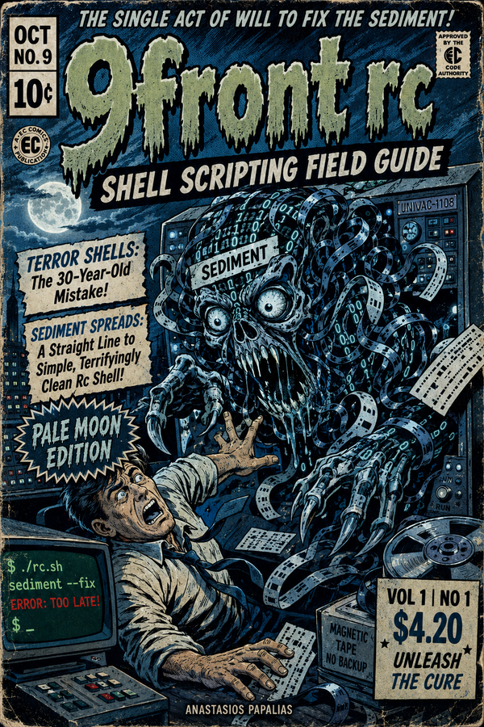
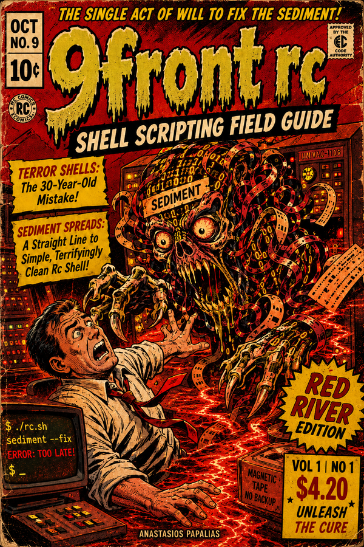

# 9front rc Shell Scripting Field Guide

**Author:** Anastasios Papalias
**First Published:** 2026
**License:** CC BY 4.0

---

A practical, example-driven guide to the **rc shell** on Plan 9 / 9front — the shell
Tom Duff designed in a single act of will in 1989, while the rest of the world kept
piling sediment onto bash. Written for the bash programmer, the curious developer,
and the Plan 9 user alike: every concept is framed as *here is how bash does this —
here is how rc does it — here is what the difference means*.

It is not a tutorial dressed as a reference. It is an autopsy that becomes a mirror:
twelve chapters of rc, wrapped in a eulogy, seven interludes, and a reckoning, that
ask why we still run the worse-designed shell — and what else in our tools we have
stopped noticing.

---

## Two Editions — Same Book, Different Skin

This community edition ships as a **fully illustrated EC-Comics horror-pulp magazine**,
in two collectible printings. Identical text; different art set and palette.

| Edition | Mood | File |
|---------|------|------|
| 🌑 **PALE MOON** | Cold, moonlit, blue-black | [`9front-rc-field-guide_PALE-MOON.pdf`](9front-rc-field-guide_PALE-MOON.pdf) |
| 🩸 **RED RIVER** | Lurid, blood-red, lava-hot | [`9front-rc-field-guide_RED-RIVER.pdf`](9front-rc-field-guide_RED-RIVER.pdf) |

Each: 76 pages, 6×9″ digest, with a comic-strip banner per chapter, dark
philosophical interludes, and the full polemic.

  
  &nbsp;
  

---

## What's Inside

- **Ch 0 — A Eulogy for a Better Idea** · the thesis: the best-designed shell lost
- **Ch 1–12** · the language: one quoting rule, lists, `~`, `fn`, I/O, `rfork`,
  error handling, Plan 9 as a system, real scripts, and the bash habits that break
- **7 Interludes** · the lab that fixed Unix · Duff's single act · *scanned once*
  (why Shellshock was impossible in rc) · two types not one · 144,000 lines ·
  the idea that arrived too early · why the better shell lost
- **Ch 13 — The Reckoning** · what survived, and the mirror turned on the reader
- **Appendices** · quick reference · full rc-vs-bash comparison · bibliography

---

## License

Community Edition: **CC BY 4.0** — free to share and adapt with attribution.
Paid full editions of select titles: [acopon.online](https://acopon.online).

*Anastasios Papalias — Thessaloniki, 2026*
